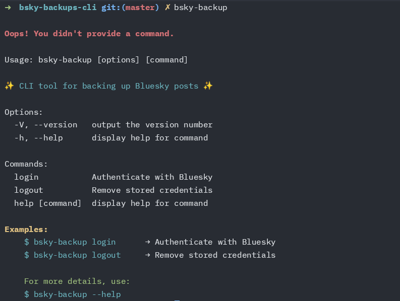

# bsky-backups-cli

A CLI tool that you can use to backup your Bluesky posts on Storacha



## Usage

Install the CLI globally with the command below

```shell
npm i -g bsky-backup
```

To use the CLI you need to authenticate with your Bluesky handle (username) and a app password. It is different from your account password.

You can generate one by visting your [settings](https://bsky.app/settings/app-passwords)

Login with the command below and you'll be prompted for your handle and the app password you've created.

```shell
bsky-backup login
```
